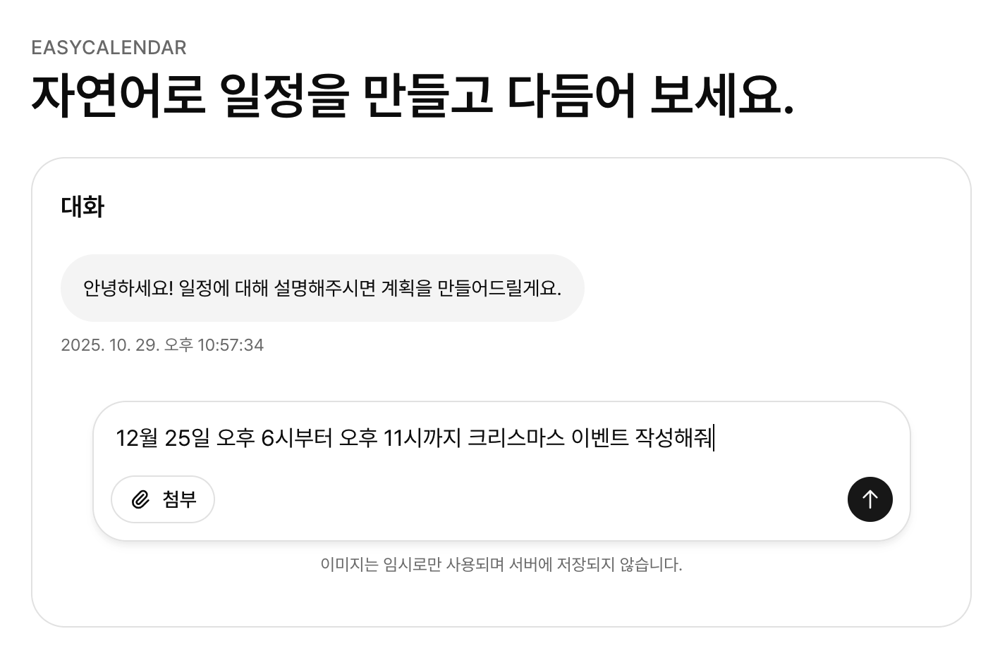
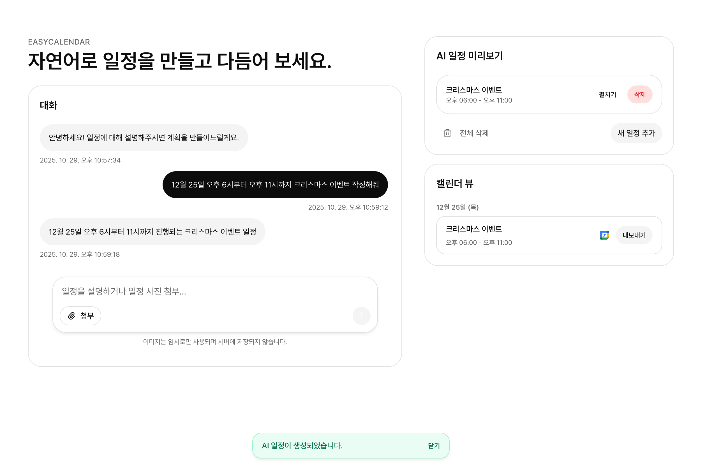
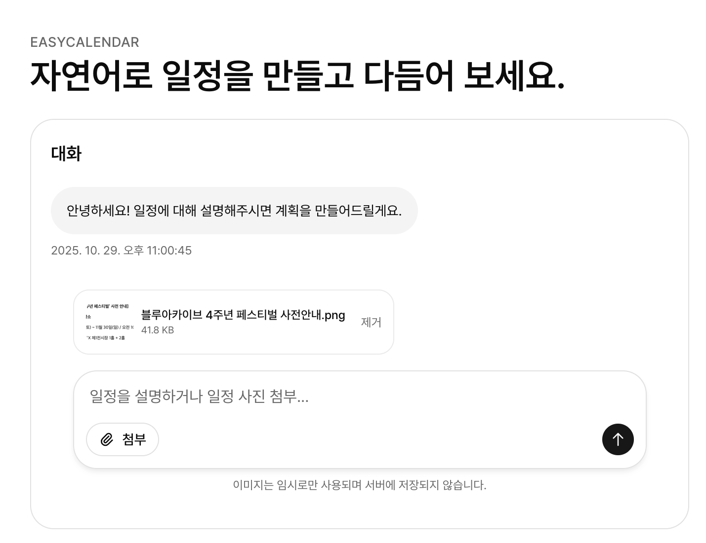
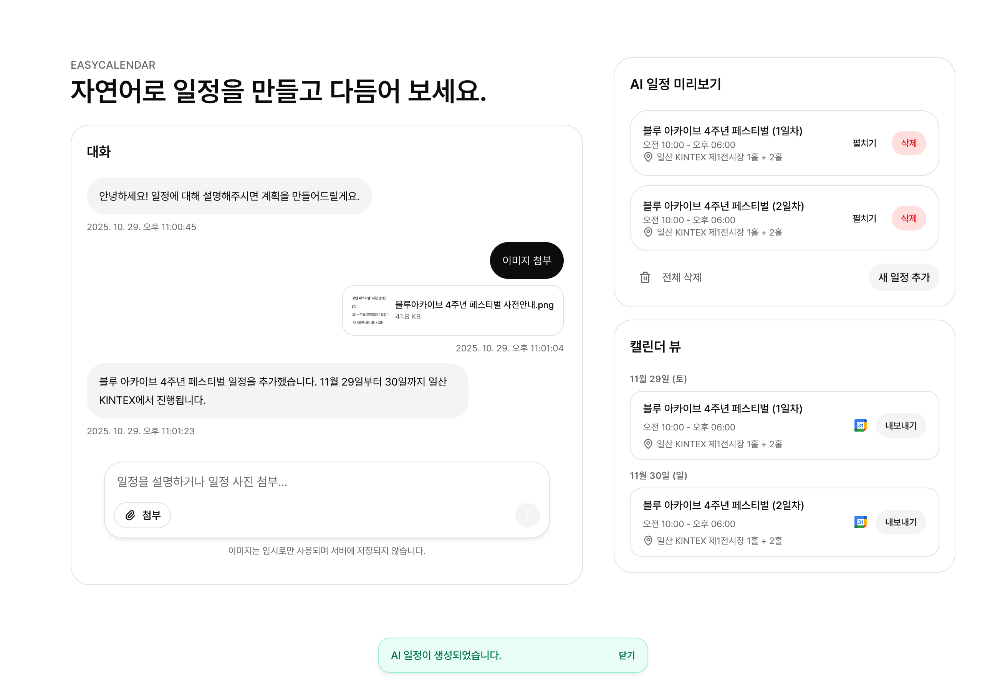
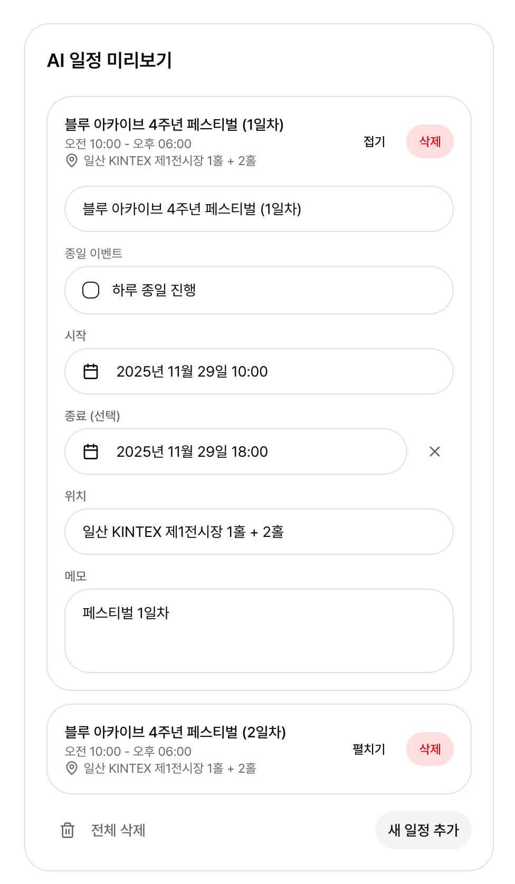
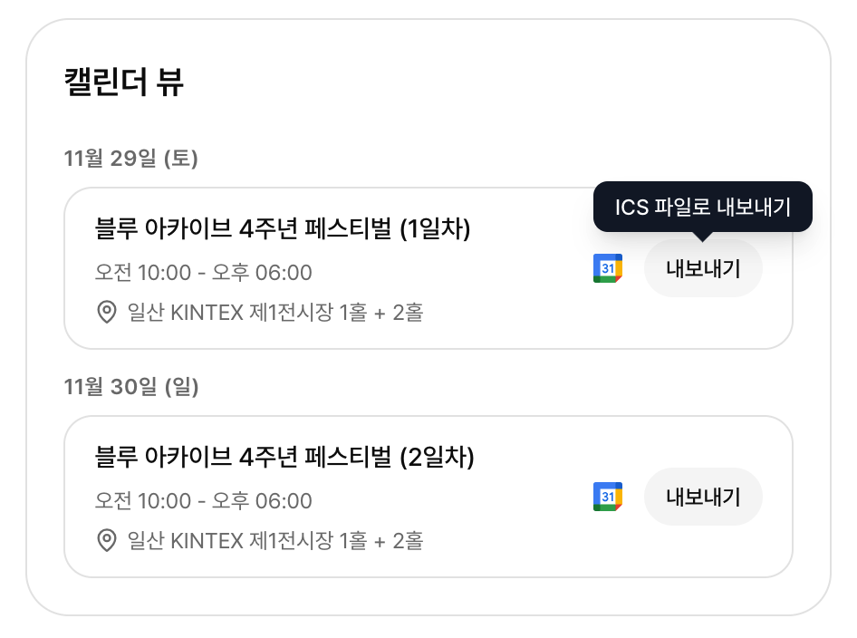

## EasyCalendar

EasyCalendar는 자연어로 일정을 생성하고 다듬을 수 있는 Next.js 기반 캘린더 도우미입니다. 사용자는 채팅창에 원하는 계획을 입력하거나 이미지를 업로드하여 AI에게 빠르게 일정을 요청하고, 결과는 우측 미리보기 패널에서 바로 확인할 수 있습니다.

### 쉽게 빠르게 일정 추가하기
<div align="center">
  
  
</div>

### 이미지를 기반으로 일정 분석하고 추가하기
<div align="center">
  
  
</div>

### 추가된 일정 수정 및 새로 추가 가능, ICS 파일 다운로드 및 구글 캘린더 내보내기 가능
<div align="center">
  
  
</div>

### 주요 기능
- **AI 대화형 일정 생성**: Groq Llama 4 VLM과 OpenRouter 생태계 모델을 상황에 맞게 선택해 자연어·이미지 입력에서 일정을 추출합니다. 대화창 우측 상단의 "모델 제공자" 드롭다운에서 즉시 공급자를 바꿀 수 있습니다.
- **실시간 미리보기 편집**: 생성된 일정 제목, 위치, 메모 등을 인라인으로 수정하고, 종일/시간 단위 전환, 종료 시간 초기화 등을 직관적으로 수행할 수 있습니다.
- **파일 첨부 및 이미지 이해**: 이미지 속 정보까지 고려해 일정을 제안하도록 비전 모델을 선택적으로 사용할 수 있습니다.
- **캘린더 정리와 내보내기**: 일정을 날짜별로 그룹화하여 보여주고, Google Calendar 추가나 ICS 파일로 내보내는 기능을 제공합니다.
- **세션 저장 및 되돌리기**: 브라우저 세션에 자동 저장되고 삭제 시 되돌리기 토스트를 제공해 실수로 인한 손실을 줄입니다.

### 실행 방법
```bash
npm install
npm run dev
```

브라우저에서 [http://localhost:3000](http://localhost:3000)에 접속해 기능을 확인할 수 있습니다. `.env.local`에서 Groq/OpenRouter 키 및 `PLANNER_AI_PROVIDER`를 설정하면 됩니다.

#### AI Provider 설정
| 변수 | 설명 |
| --- | --- |
| `PLANNER_AI_PROVIDER` | `openrouter`, `groq`, `auto` 중 선택. 기본값 `auto`는 Groq 키가 있으면 Llama 4(VLM) 모델을 우선 사용하고, 없으면 OpenRouter로 자동 폴백합니다. |
| `NEXT_PUBLIC_DEFAULT_AI_PROVIDER` | 클라이언트 대화창 드롭다운의 기본 표시값. 보통 `PLANNER_AI_PROVIDER`와 동일하게 맞춥니다. |
| `GROQ_API_KEY` | Groq Console에서 발급. 이미지+텍스트 모두 처리 가능한 `meta-llama/llama-4-maverick-17b-128e-instruct`가 기본입니다. |
| `GROQ_MODEL`, `GROQ_VISION_MODEL` | 텍스트/멀티모달 모델 ID 커스터마이즈. 미설정 시 각각 70B 텍스트 모델과 Llama 4 VLM을 사용합니다. |
| `OPENROUTER_API_KEY` | 기존과 동일. Groq가 응답하지 않거나 auto 모드에서 키가 없을 때 사용됩니다. |
| `OPENROUTER_MODEL`, `OPENROUTER_VISION_MODEL` | 텍스트/이미지 모델 기본값을 덮어씁니다. |

> **Tip:** 사용자는 대화창에서 즉시 공급자를 바꿀 수 있으므로, 운영 환경에서는 두 API 키를 모두 넣고 `PLANNER_AI_PROVIDER=auto`로 두면 장애 시 자동 폴백합니다.

> **중요:** OpenRouter를 사용하는 경우, **Training, Logging & Privacy** 탭에서 제공되는 두 옵션을 모두 활성화해야 무료 모델을 정상적으로 호출할 수 있습니다.

### TODO
- [ ] 과도한 요청을 제한하는 로직 추가 (AI 요청 비용 절감)
- [ ] 자연어 날짜 표현(예: 다다음 주 수요일, 글피 등) 인식을 고도화하고 전용 호출 도구 구현
- [ ] Cloudflare Turnstile 적용으로 악의적 사용 방지
- [ ] 모바일 UIUX 개선하기
- [ ] Groq의 OpenAI Whisper 모델 연동하여 음성으로 일정 생성 기능 구현하기

## 라이선스

이 프로젝트는 GPL-3.0 라이선스 하에 배포됩니다. 자세한 내용은 [LICENSE](LICENSE) 파일을 참조하세요.
